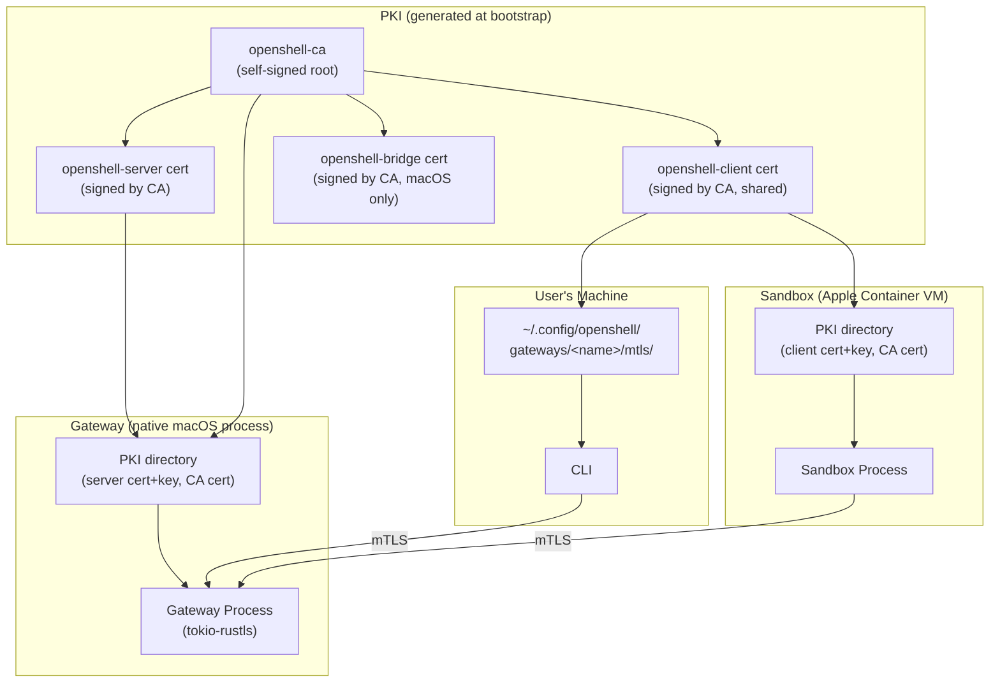
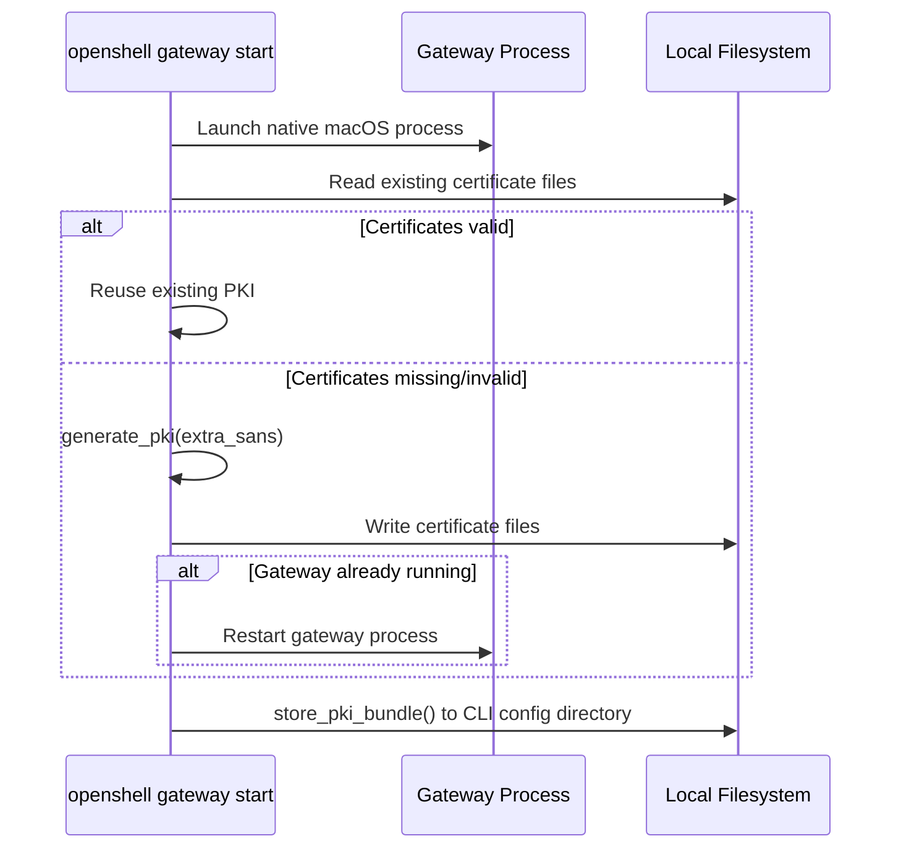
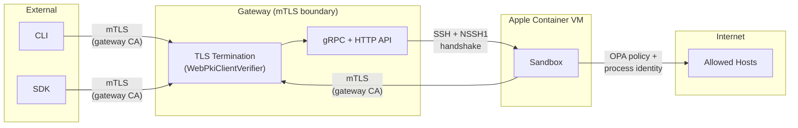

# Gateway Security

## Overview

By default, communication with the OpenShell gateway is secured by mutual TLS (mTLS). The CLI, SDK, and sandboxes present certificates signed by the gateway CA before they reach any application handler. The PKI is bootstrapped automatically during gateway deployment, and certificates are stored on the local filesystem without manual configuration.

The gateway also supports Cloudflare-fronted deployments where the edge, not the gateway, is the first authentication boundary. In that mode the gateway either keeps TLS enabled but allows no-certificate client handshakes (`allow_unauthenticated=true`) and relies on application-layer Cloudflare JWTs, or disables gateway TLS entirely and serves plaintext behind a trusted reverse proxy or tunnel.

This document covers the certificate hierarchy, the bootstrap process, how gateway transport security modes are enforced, how sandboxes and the CLI consume their certificates, and the broader security model of the gateway.

## Architecture Diagram



## Certificate Hierarchy

The PKI is a single-tier CA hierarchy generated by the `openshell-bootstrap` crate using `rcgen`. All certificates are created in a single pass at gateway bootstrap time.

```
openshell-ca  (Self-signed Root CA, O=openshell, CN=openshell-ca)
├── openshell-server  (Leaf cert, CN=openshell-server)
│   SANs: localhost, 127.0.0.1
│          + extra SANs for remote deployments
│
├── openshell-client  (Leaf cert, CN=openshell-client)
│   Shared by the CLI and all sandboxes.
│
└── openshell-bridge  (Leaf cert, CN=openshell-bridge)
    SANs: host.containers.internal, localhost, 127.0.0.1
    Used by the container bridge daemon on macOS (Apple Container backend).
    The gateway authenticates to the bridge using the client cert, and the
    bridge presents this cert as its server identity.
```

Key design decisions:

- **Single client certificate**: One client cert is shared by the CLI and every sandbox. This simplifies secret management. Individual sandbox identity is not expressed at the TLS layer; post-authentication identification uses the `x-sandbox-id` gRPC header.
- **Long-lived certificates**: Certificates use `rcgen` defaults (validity ~1975--4096), which effectively never expire. This is appropriate for an internal dev PKI where certificates are ephemeral to the gateway's lifetime.
- **CA key not persisted**: The CA private key is used only during generation and is not written to disk. Re-signing requires regenerating the entire PKI.

See `crates/openshell-bootstrap/src/pki.rs:35` for the `generate_pki()` implementation and `crates/openshell-bootstrap/src/pki.rs:18` for the default SAN list.

## Certificate Distribution

The PKI bundle is stored on the local filesystem. The bootstrap writes certificates to the gateway's data directory and to the CLI configuration directory.

### Gateway Certificate Files

The gateway process reads certificates from its data directory:

| File | Contents | Purpose |
|---|---|---|
| `server/tls.crt` | Server certificate | Gateway TLS identity |
| `server/tls.key` | Server private key | Gateway TLS identity |
| `client-ca/ca.crt` | CA certificate | Client certificate verification |

Environment variables point the gateway binary to these paths:

```
OPENSHELL_TLS_CERT=<data_dir>/server/tls.crt
OPENSHELL_TLS_KEY=<data_dir>/server/tls.key
OPENSHELL_TLS_CLIENT_CA=<data_dir>/client-ca/ca.crt
```

### Sandbox Certificate Injection

When the gateway creates a sandbox (Apple Container VM), it copies the client certificate bundle into the VM filesystem. The sandbox process reads:

```
OPENSHELL_TLS_CA=/etc/openshell-tls/client/ca.crt
OPENSHELL_TLS_CERT=/etc/openshell-tls/client/tls.crt
OPENSHELL_TLS_KEY=/etc/openshell-tls/client/tls.key
OPENSHELL_ENDPOINT=https://host.containers.internal:8080
```

### CLI Local Storage

The CLI's copy of the client certificate bundle is written to:

```
$XDG_CONFIG_HOME/openshell/gateways/<gateway-name>/mtls/
├── ca.crt
├── tls.crt
└── tls.key
```

Files are written atomically using a temp-dir -> validate -> rename strategy with backup and rollback on failure. See `crates/openshell-bootstrap/src/mtls.rs:10`.

## PKI Bootstrap Sequence

PKI provisioning occurs during gateway bootstrap (`crates/openshell-bootstrap/src/lib.rs`). The full sequence:

1. **Gateway process launched** -- the gateway starts as a native macOS process.
2. **Extra SANs computed** -- for remote deployments, the SSH destination hostname and its resolved IP are added to the server certificate's SANs. For local deployments, the detected gateway host (if any) is added.
3. **`reconcile_pki()` called**:
   1. Attempt to load existing PKI from the gateway's data directory. Each file is validated for PEM markers.
   2. **If files exist and are valid**: reuse them and return `rotated=false`.
   3. **If files are missing, incomplete, or malformed**: generate fresh PKI via `generate_pki()`, write certificate files to the data directory, and return `rotated=true`.
4. **Gateway restart on rotation** -- if `rotated=true` and the gateway process is already running, it is restarted to pick up the new certificates.
5. **CLI-side credential storage** -- `store_pki_bundle()` writes `ca.crt`, `tls.crt`, `tls.key` to the local filesystem.



## Gateway TLS Enforcement

The gateway supports three transport modes:

1. **mTLS (default)** -- TLS is enabled and client certificates are required.
2. **Dual-auth TLS** -- TLS is enabled, but the handshake also accepts clients without certificates (`allow_unauthenticated=true`). This is used for Cloudflare Tunnel deployments where the edge authenticates the user and forwards a Cloudflare JWT to the gateway.
3. **Plaintext behind edge** -- TLS is disabled at the gateway and the service listens on HTTP behind a trusted reverse proxy or tunnel.

### Server Configuration

`TlsAcceptor::from_files()` (`crates/openshell-server/src/tls.rs:27`) constructs the `rustls::ServerConfig`:

1. **Server identity**: loads the server certificate and private key from PEM files (supports PKCS#1, PKCS#8, and SEC1 key formats).
2. **Client verification**: builds a `WebPkiClientVerifier` from the CA certificate. In the default mode it requires a valid client certificate; in dual-auth mode it also accepts no-certificate clients and defers authentication to the HTTP/gRPC layer.
3. **ALPN**: advertises `h2` and `http/1.1` for protocol negotiation.

### Connection Flow

```
TCP accept
  → TLS handshake (mandatory client cert in mTLS mode, optional in dual-auth mode)
  → hyper auto-negotiates HTTP/1.1 or HTTP/2 via ALPN
  → MultiplexedService routes by content-type:
      ├── application/grpc → GrpcRouter
      └── other → Axum HTTP Router
```

All traffic shares a single port. When TLS is enabled, the TLS handshake occurs before any HTTP parsing. In plaintext mode, the gateway expects an upstream reverse proxy or tunnel to be the outer security boundary.

### Cloudflare-Specific HTTP Endpoints

Cloudflare-fronted gateways add two HTTP endpoints on the same multiplexed port:

- `/auth/connect` -- browser login relay that reads the `CF_Authorization` cookie server-side and POSTs the token back to the CLI's localhost callback server.
- `/_ws_tunnel` -- WebSocket upgrade endpoint used to carry gRPC and SSH bytes through Cloudflare Access.

The WebSocket tunnel bridges directly into the gateway's `MultiplexedService` over an in-memory duplex stream. It does not re-enter the public listener, so it behaves the same whether the public listener is plaintext or TLS-backed.

### What Gets Rejected

The e2e test suite (`e2e/python/test_security_tls.py`) validates four scenarios:

| Scenario | Result |
|---|---|
| Client presents correct mTLS cert | `HEALTHY` response |
| Client trusts CA but presents no client cert | `UNAVAILABLE` -- handshake terminated |
| Client presents cert signed by a different CA | `UNAVAILABLE` -- handshake terminated |
| Client connects with plaintext (no TLS) | `UNAVAILABLE` -- transport failure |

## Sandbox-to-Gateway mTLS

Sandboxes connect back to the gateway at startup to fetch their policy and provider credentials. The gRPC client (`crates/openshell-sandbox/src/grpc_client.rs:18`) reads three environment variables to configure mTLS:

| Env Var | Value |
|---|---|
| `OPENSHELL_TLS_CA` | `/etc/openshell-tls/client/ca.crt` |
| `OPENSHELL_TLS_CERT` | `/etc/openshell-tls/client/tls.crt` |
| `OPENSHELL_TLS_KEY` | `/etc/openshell-tls/client/tls.key` |

These are used to build a `tonic::transport::ClientTlsConfig` with:
- `ca_certificate()` -- verifies the server's certificate against the gateway CA.
- `identity()` -- presents the shared client certificate for mTLS.

The sandbox calls two RPCs over this authenticated channel:
- `GetSandboxSettings` -- fetches the YAML policy that governs the sandbox's behavior.
- `GetSandboxProviderEnvironment` -- fetches provider credentials as environment variables.

## Bridge Daemon Authentication (Apple Container Backend)

When the gateway uses the `apple-container` sandbox backend (macOS), it manages sandboxes through a Swift bridge daemon running on the host. The bridge daemon exposes a gRPC service (`ContainerBridge`, defined in `proto/container_bridge.proto`) that translates calls into Apple Container XPC operations.

### Threat

Without authentication, any process on the vmnet (or localhost) could issue gRPC calls to the bridge daemon and create, destroy, or exec into sandbox containers.

### Defense: Mutual TLS

The gateway-to-bridge connection uses the same PKI trust root as all other OpenShell mTLS connections:

- **Bridge server cert** (`CN=openshell-bridge`): presented by the bridge daemon. SANs include `host.containers.internal` (the hostname Apple Container VMs use to reach the host), `localhost`, and `127.0.0.1`.
- **Client cert** (`CN=openshell-client`): presented by the gateway to authenticate itself to the bridge.
- **CA verification**: both sides verify the peer's certificate against the OpenShell CA.

```
Gateway (native macOS process)
  │
  │  mTLS: client cert = openshell-client
  │         server cert = openshell-bridge
  │         CA = openshell-ca
  ▼
Bridge Daemon (macOS host, port 50052)
  │
  │  XPC (local IPC)
  ▼
Apple Container Runtime
```

### Configuration

The bridge TLS is configured via CLI flags or environment variables on the gateway binary:

| Flag | Env Var | Purpose |
|---|---|---|
| `--sandbox-backend` | `OPENSHELL_SANDBOX_BACKEND` | `"apple-container"` |
| `--bridge-endpoint` | `OPENSHELL_BRIDGE_ENDPOINT` | Bridge daemon gRPC endpoint (e.g., `https://host.containers.internal:50052`) |
| `--bridge-tls-ca` | `OPENSHELL_BRIDGE_TLS_CA` | CA cert for verifying the bridge's server cert |
| `--bridge-tls-cert` | `OPENSHELL_BRIDGE_TLS_CERT` | Client cert the gateway presents to the bridge |
| `--bridge-tls-key` | `OPENSHELL_BRIDGE_TLS_KEY` | Client key for the gateway's bridge cert |

When bridge TLS is not configured, the gateway connects without authentication and logs a warning. This is acceptable for local development but not for shared environments.

### Implementation

- PKI generation: `crates/openshell-bootstrap/src/pki.rs` — `PkiBundle` includes `bridge_cert_pem` and `bridge_key_pem`
- Bridge client: `crates/openshell-server/src/sandbox/bridge_client.rs` — `BridgeClient::connect()` with tonic `ClientTlsConfig`
- Proto definition: `proto/container_bridge.proto` — `ContainerBridge` service
- Config: `crates/openshell-core/src/config.rs` — `BridgeTlsConfig` struct, `sandbox_backend` and `bridge_endpoint` fields

## SSH Tunnel Authentication

SSH connections into sandboxes pass through the gateway's HTTP CONNECT tunnel at `/connect/ssh`. This adds a second authentication layer on top of mTLS.

### Request Headers

| Header | Purpose |
|---|---|
| `x-sandbox-id` | Identifies the target sandbox |
| `x-sandbox-token` | Session token (created via `CreateSshSession` RPC) |

The gateway validates the token against the stored `SshSession` record and checks:

1. The token has not been revoked.
2. The `sandbox_id` matches the request header.
3. The token has not expired (`expires_at_ms` check; 0 means no expiry for backward compatibility).

### Session Lifecycle

SSH session tokens have a configurable TTL (`ssh_session_ttl_secs`, default 24 hours). The `expires_at_ms` field is set at creation time and checked on every tunnel request. Setting the TTL to 0 disables expiry.

Sessions are cleaned up automatically:

- **On sandbox deletion**: all SSH sessions for the deleted sandbox are removed from the store.
- **Background reaper**: a periodic task (hourly) deletes expired and revoked session records to prevent unbounded database growth.

### Connection Limits

The gateway enforces two concurrent connection limits to bound the impact of credential misuse:

| Limit | Value | Purpose |
|---|---|---|
| Per-token | 10 concurrent tunnels | Limits damage from a single leaked token |
| Per-sandbox | 20 concurrent tunnels | Prevents bypass via creating many tokens for one sandbox |

These limits are tracked in-memory and decremented when tunnels close. Exceeding either limit returns HTTP 429 (Too Many Requests).

### NSSH1 Handshake

After the gateway connects to the sandbox's SSH port, it performs a cryptographic handshake:

```
NSSH1 <token> <timestamp> <nonce> <hmac_signature>\n
```

- **HMAC**: `HMAC-SHA256(secret, "{token}|{timestamp}|{nonce}")`, hex-encoded.
- **Secret**: shared via `OPENSHELL_SSH_HANDSHAKE_SECRET` env var, set on both the gateway and sandbox.
- **Clock skew tolerance**: configurable via `OPENSHELL_SSH_HANDSHAKE_SKEW_SECS` (default 300 seconds).
- **Expected response**: `OK\n` from the sandbox.

This handshake prevents direct connections to sandbox SSH ports from processes on the vmnet, even from other VMs that share the network.

## Port Configuration

The gateway binds directly on the host -- there are no container or service layers in between:

| Layer | Port | Configurable Via |
|---|---|---|
| Server bind | `8080` | `--port` flag / `OPENSHELL_SERVER_PORT` env var |

The server binds `0.0.0.0:8080` and clients connect directly to this port.

## Security Model Summary

### Trust Boundaries



### What Is Authenticated

| Boundary | Mechanism |
|---|---|
| External → Gateway | mTLS with gateway CA by default, or trusted reverse-proxy/Cloudflare boundary in edge mode |
| Sandbox → Gateway | mTLS with shared client cert |
| Gateway → Sandbox (SSH) | Session token + HMAC-SHA256 handshake (NSSH1) |
| Gateway → Bridge Daemon | mTLS with gateway CA (Apple Container backend only) |
| Sandbox → External (network) | OPA policy + process identity binding via `/proc` |

### What Is Not Authenticated (by Design)

- **Individual sandbox identity at the TLS layer**: all sandboxes share one client certificate (`CN=openshell-client`). Post-TLS identification uses the `x-sandbox-id` gRPC metadata header, which is trusted because it arrives over an mTLS-authenticated channel.
- **Health endpoints in reverse-proxy mode**: when the gateway is deployed behind Cloudflare or another trusted edge, `/health`, `/healthz`, and `/readyz` are protected by that upstream boundary rather than by direct mTLS at the gateway.

### Gateway Security Context

The gateway runs as a native macOS process under the current user account. It requires no elevated privileges.

## Threat Model

This section defines the primary attacker profiles, what the current design protects, and where residual risk remains.

### Security Goals

- Prevent unauthenticated access to gateway APIs and SSH tunneling.
- Prevent unauthorized sandbox access across tenants/sessions.
- Protect sandbox-to-gateway policy and credential exchange in transit.
- Limit impact from network-level attackers and accidental misconfiguration.

### In Scope Threat Actors

| Threat Actor | Example Capability |
|---|---|
| Network attacker | Can observe/modify traffic between clients and gateway |
| Unauthorized external client | Can reach gateway port but has no valid client cert |
| Compromised sandbox workload | Has code execution inside one sandbox VM |
| Malicious VM on vmnet | Can attempt direct VM-to-VM connections |
| Stolen CLI credentials | Has copied `ca.crt`/`tls.crt`/`tls.key` from a developer machine |

### Primary Defenses

| Threat | Existing Defense | Notes |
|---|---|---|
| MITM or passive interception of gateway traffic | Mandatory mTLS with gateway CA, or trusted reverse-proxy boundary in Cloudflare mode | Default mode is direct mTLS; reverse-proxy mode shifts the outer trust boundary upstream |
| Unauthenticated API/health access | mTLS by default, or Cloudflare/reverse-proxy auth in edge mode | `/health*` are direct-mTLS only in the default deployment mode |
| Forged SSH tunnel connection to sandbox | Session token validation + NSSH1 HMAC handshake | Requires token and shared handshake secret |
| Direct access to sandbox SSH port from vmnet peers | NSSH1 challenge-response | Connection denied without valid signature |
| Unauthorized outbound internet access from sandbox | OPA policy + process identity checks | Applies to sandbox egress policy layer |

### Residual Risks and Current Tradeoffs

| Risk | Why It Exists |
|---|---|
| No per-sandbox TLS identity | All sandboxes and CLI share one client certificate |
| Broad blast radius on key compromise | Shared client key reuse across multiple components |
| Weak cryptoperiod | Certificates are effectively non-expiring by default |
| Limited fine-grained revocation | CA private key is not persisted; rotation is coarse-grained |
| Local credential theft risk | CLI mTLS key material is stored on developer filesystem |
| SSH token + mTLS = persistent access within trust boundary | SSH tokens expire after 24h (configurable) and are capped at 3 concurrent connections per token / 20 per sandbox, but within the mTLS trust boundary a stolen token remains usable until TTL expires |

### Out of Scope / Not Defended By This Layer

- A compromised gateway process with access to the certificate files on disk.
- Host-level compromise of the macOS machine running the gateway.
- Host-level compromise of the developer workstation running the CLI.
- Application-layer authorization bugs after mTLS authentication succeeds.

### Trust Assumptions

- The gateway CA is generated and distributed without interception during bootstrap.
- Certificate file access is restricted to the gateway process and intended operators.
- Gateway and sandbox container images are trusted and not tampered with.
- System clocks are reasonably synchronized for timestamp-based SSH handshake checks.

## Sandbox Outbound TLS (L7 Inspection)

Separate from the gateway mTLS infrastructure, each sandbox has an independent TLS capability for inspecting outbound HTTPS traffic. This is documented here for completeness because it involves a distinct, per-sandbox PKI.

The sandbox proxy automatically detects and terminates TLS on outbound HTTPS connections by peeking the first bytes of each tunnel. This enables credential injection and L7 inspection without requiring explicit policy configuration. The proxy performs TLS man-in-the-middle inspection:

1. **Ephemeral sandbox CA**: a per-sandbox CA (`CN=OpenShell Sandbox CA, O=OpenShell`) is generated at sandbox startup. This CA is completely independent of the gateway mTLS CA.
2. **Trust injection**: the sandbox CA is written to the sandbox filesystem and injected via `NODE_EXTRA_CA_CERTS` and `SSL_CERT_FILE` so processes inside the sandbox trust it.
3. **Dynamic leaf certs**: for each target hostname, the proxy generates and caches a leaf certificate signed by the sandbox CA (up to 256 entries).
4. **Upstream verification**: the proxy verifies upstream server certificates against Mozilla root CAs (`webpki-roots`), not against the gateway CA.

This capability is orthogonal to gateway mTLS -- it operates only on sandbox-to-internet traffic and uses entirely separate key material. See [Policy Language](security-policy.md) for configuration details.

## Cross-References

- [Gateway Architecture](gateway.md) -- protocol multiplexing, gRPC services, persistence, and SSH tunneling
- [Gateway Bootstrap](gateway-single-node.md) -- gateway provisioning, Apple Container lifecycle, and credential management
- [Sandbox Architecture](sandbox.md) -- sandbox-side isolation, proxy, and policy enforcement
- [Sandbox Connect](sandbox-connect.md) -- client-side SSH connection flow through the gateway
- [Policy Language](security-policy.md) -- YAML/Rego policy system including L7 TLS inspection configuration
